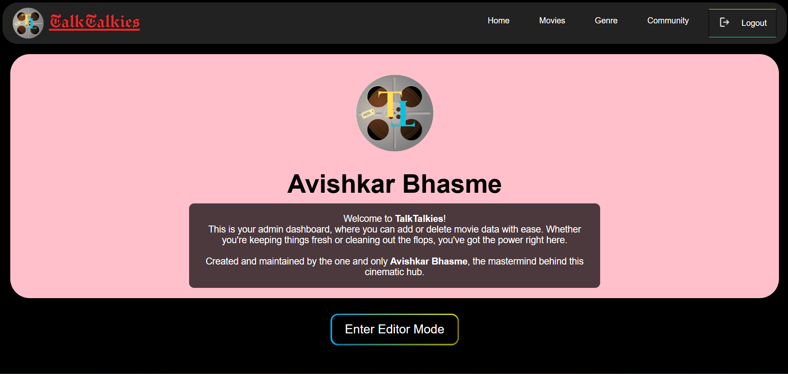

# 🎬 Talk_Talkies

**TalkTalkies** is a comprehensive movie suggestion platform designed to help users discover new films based on their preferences, engage with a vibrant movie-loving community, and provide administrative tools for content management.

---

## ✨ Features

### 1. Personalized Movie Suggestions
- Genre-Based Filtering: Users can filter movies by various genres (e.g., Action, Comedy, Drama, Sci-Fi).

- Rating-Based Recommendations: Discover highly-rated movies to ensure quality viewing experiences.

- Year-Specific Search: Find movies released in a particular year or within a specific range.

### 2. Admin Panel for Content Management
- Secure Admin Login: A dedicated login for administrators to manage the movie database.

- Add Movies: Admins can easily add new movie entries, including details like title, genre, year, rating, description, and poster URL.

- Remove Movies: Admins have the ability to remove outdated or incorrect movie entries from the database.

### 3. Interactive User Community
- Community Channels: Users can join different community channels, similar to popular messaging apps like WhatsApp or Telegram, to discuss movies.

- Share Thoughts: A platform for users to share their reviews, opinions, and suggestions on various films within the community.

- Real-time Interaction: Engage with other movie enthusiasts in a dynamic and interactive environment.

### 4. Detailed Movie Information
- Clickable Movie Cards: Each movie is displayed as a card on the main interface.

- Comprehensive Details: Clicking on a movie card reveals a dedicated page or modal with extensive information, including:

- Full Synopsis/Description

- Director and Cast Information

- vRelease Date

- IMDb/Rotten Tomatoes Rating (or internal rating)

- Trailer Link (if available)

- User Reviews/Comments section

### 5. Mobile Responsiveness
- The application is designed to be fully responsive, providing an optimal viewing and interaction experience across various devices, including desktops, tablets, and mobile phones.

---

## 🚀 Technologies Used

### 🖥 Frontend
- HTML5  
- CSS3
- JavaScript

### 🌐 Backend
- Node.js  
- Express.js

### 🗃️ Database
- MongoDB

---

## 💡 Usage

- **Home Page:** Browse featured and recent movies.
- **Movies Page:** Explore the entire movie catalog.
- **Genre Page:** Filter movies by genres.
- **Community Section:** Join the TalkTalkies community and engage in movie discussions.
- **Admin Login:** Restricted access dashboard to manage movie entries.

---

## 📧 Contact
- Created and maintained by Avishkar Bhasme
- 📩 Email: timepasstalkies12@gmail.com

---

## 📷 Screenshots

### 🏠 Home Page

### 🎬 Movie Details

### 🎭 Genre Page

### 💬 Community Page

### 🔐 Login & Logout

